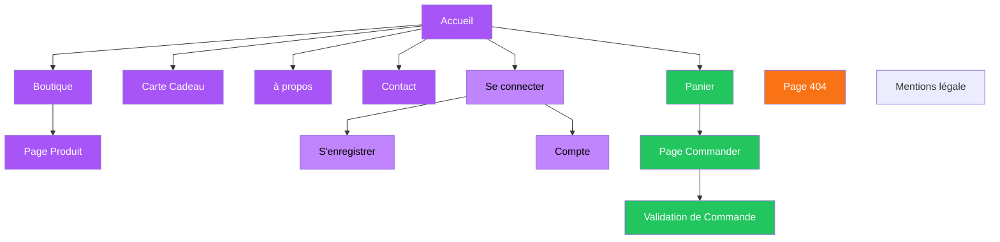

# Travail de fin d'études

<div class="text-2xl">
  Boucle-la : Une refonte au coeur du design et du développement
</div>

<div grid="~ cols-3 gap-25" class="abs-b text-sm color-gray m-5 font-weight-bold" m="t-3">
  <div>Gérard Gaétan</div>
  <div>30 Juin 2025</div>
  <div>WebDesign</div>
</div>

 <div class="abs-tl m-5 flex gap-2">
  
</div>

<div class="abs-tr m-5 flex gap-2 opacity-85">
 
</div>

<!--
Slide de présentation

Boucle-la : Une refonte au coeur du design et du développement, mon travail de fin d'études en Webdesign

-->

---
hideInToc: true
layout: image-right
image: /assets/img/toc.png
backgroundSize: contain
---

# Agenda
<Toc />

<!--
Durant cette présentation je vais évoquer différents sujets, en commençant par

- une courte introduction de ma cliente et de son projet
- ensuite j'établirai l'analyse des besoins de ma cliente
- Nous enchaînerons sur le cahier des charges avant de passer à a une courte présentation sur la conception du design et du développement du thème
- Je parlerais ensuite de l'IA de l'utilité que j'en ai faite sur le projet et de ce que j'en pense
- Enfin je terminerais par une courte conclusion

-->

---

# <div class="text-center">Introduction</div>


<p class="text-center">Boucle-la By Emilie Kaiser une entreprise spécialisée dans l'artisanat de boucles d'oreille reconnue par la commission des artisans du SPF Économie. Ce qui l'a poussée à créer des bijoux, c'est son envie de réaliser des bijoux qu'elle voudrait porter elle-même et de les partager.</p>


<div class="flex justify-center py-5">
  
</div>

## <div class="text-center m-5">Problématique</div>

> L’intelligence artificielle peut-elle suffire pour entreprendre un projet lorsqu’on n’a pas les compétences nécessaires ?

<!--

  Boucle-la est une jeune entreprise créée par Emilie Kaiser qui souhaitait partager ses créations de boucles d'oreille. Depuis peu, elle a été reconnue par la commission des artisans du SPF Économie.

  L'intelligence artificielle peut-elle suffire pour entreprendre un projet lorsqu'on n'a pas les compétences nécessaires ? il s'agit d'une question que je me suis posée au cours du développement de mon thème et que je vais tenter d'y répondre au cours de cet présentation
-->

---
layout: image-right
# the web page source
image: /assets/img/analyse-des-besoins.jpg
backgroundSize: cover
# a custom class name to the content
class: my-cool-content-on-the-left
---

# Analyse des besoins

- Refonte de son site
- Solution abordable
- Réalisation d'un logo
- Suivi du cycle de vente
- Carte cadeau
- Compte client
- Page de contact
- Application mobile

<!--

  La raison pour laquelle madame Kaiser m'a contacté dans un premier temps était que sa solution actuelle lui coûtait beaucoup trop d'argent par rapport au revenu qu'elle avait, elle souhaitait donc :

  - Refonte de son site actuel pour avoir un nouveau design qui soit plus moderne et responsive
  - Migration de la solution actuelle (Wix) vers WordPress et WooCommerce
  - Réalisation d'un logo, car la cliente n'avait pas de logo initialement et souhaitait un logo pour améliorer son image de marque
  - Suivi du cycle de vente madame Kaiser voulait une solution qui ne lui enlèverait rien de ce dont elle a l'habitude (ajout de produit, suivi des commandes)
  - Elle souhaitait également une page cadeau pour des occasions spéciales comme les fêtes de fin d'année
  - Un compte client pour faciliter la communication avec les clients et le suivi des commandes
  - Une page de contact simple où elle pourrait facilement être joignable
  - et enfin une application mobile pour pouvoir ajouter les poroduits directement à partir de son téléphone
-->

---

# <div class="text-center">Cahier des charges</div>

<p class="text-center">Il permet de structurer le projet en définissant les besoins du client : UX, arborescence, wireframes, charte graphique (logo, typographies, couleurs) et devis. C’est un outil clé pour garantir une vision claire, partagée et réalisable du site.</p>

<div class="flex justify-center py-5">
  
</div>

<!--
  La rédaction d'un cahier des charges permet de structurer le projet en définissant les besoins du client tels qu'identifiés lors de l'analyse préalable.

  Ce document constitue une base essentiel à la bonne conduite du projet webdesign. Il permet de définir des points tels que l'expérience utilisateur, d'élaborer l'arborescence du site, de définir une stratégie de communication, de présenter des wireframes, d'établir une charte graphique pour définir l'usage des typographie, couleurs ou encore la réalisation et l'usage du logo, on peut également joindre a se document un devis (pour les besoins de ce projet le devis a été réaliser uniquement à titre informatif et n'engage pas la cliente puisque se projet a été réaliser gratuitement).

  Chaque élément du cahier des charges vise à garantir une vision partagée entre la cliente et moi-même, tout en assurant la cohérence, faisabilité et qualité du projet.
-->

---
hideInToc: true
---

# Wireframes

<div class="flex justify-center py-5">
  
</div>

<!--
 Voici un échantillon de wireframe, la conception de ces wireframes permet de pouvoir définir l'emplacement de chaque bloc.

 On peut également observer facilement leur comportement entre différentes tailles d'écran.

 Ici je vous propose d'observer le wireframe de la page boutique

 Le format desktop on retrouve des éléments familiers : une barre de navigation classique une disposition de produits sous forme de grille et les éléments de la page se plaçant les uns à côté des autres.
-->


---
hideInToc: true
---

# <div class="text-center">Arborescence du site</div>



<div class="mt-8 flex flex-col items-start gap-1 text-[10px]">
  <div class="font-bold mb-0.5">Légende</div>
  <div><span class="px-1 py-0.5 rounded" style="background-color: #a855f7; color: #fff;">Menu (mauve foncé)</span> : éléments directs de la page d'accueil</div>
  <div><span class="px-1 py-0.5 rounded" style="background-color: #c4b5fd; color: #000;">Compte (mauve clair)</span> : éléments conditionnels (affichés si l'utilisateur est connecté)</div>
  <div><span class="px-1 py-0.5 rounded" style="background-color: #22c55e; color: #fff;">Panier (vert)</span> : pages liées au panier</div>
  <div><span class="px-1 py-0.5 rounded" style="background-color: #f59e42; color: #fff;">404 (orange)</span> : page d'erreur</div>
</div>

<!--
Sur cette slide, on peut observer l’arborescence du site.

- **En mauve foncé**, ce sont les éléments toujours présents dans la barre de navigation : les pages principales du site.

- **Le mauve clair** correspond aussi à des éléments dans la barre de navigation, mais leur contenu varie selon que l’utilisateur est connecté ou non.

- **Les éléments en bleu** sont accessibles uniquement si l’utilisateur est connecté.

- **Les éléments en vert** ne sont visibles que si des produits sont présents dans le panier.

- **En orange**, on trouve la page 404.

- Enfin, la page Mentions légales est accessible via le pied de page, qui regroupe les différents liens légaux.
-->

---
hideInToc: true
---

# <div class="text-center">Le Logo</div>

<div class="grid grid-cols-2 gap-6 place-items-center">
  <div class="flex flex-col items-center">
    <p class="text-xs">Logo version 1</p>
    
  </div>
  <div class="flex flex-col items-center">
    <p class="text-xs">Logo version 2 - Bo Only</p>
    
  </div>
  <div class="flex flex-col items-center">
    <p class="text-xs">Logo version 2 - Texte horizontal</p>
    
  </div>
  <div class="flex flex-col items-center">
    <p class="text-xs">Logo version 2 - Texte vertical</p>
    
  </div>
</div>

<!--
Ma cliente souhaitait un logo pour renforcer son image de marque.
Elle voulait quelque chose de simple mais glamour, évoquant une boucle d’oreille, avec la présence du slogan "by Emilie Kaiser".
C’est sur cette base que je lui ai proposé une première version du logo.

Même si cette version répondait à ses attentes, elle s’est révélée trop chargée et devenait illisible sur les petits écrans.
Je lui ai donc proposé une version simplifiée, avec uniquement "BO", une nomenclature qu’elle utilise régulièrement pour ses produits.
Je lui ai aussi présenté plusieurs déclinaisons : texte horizontal ou vertical, selon les usages (packaging, pied de page, newsletter, etc.).
-->

---

# Conception du design

<div class="flex justify-center py-5">
  
</div>

<!--
Une fois les wireframes et le logo validés, on peut passer à la conception de l’interface utilisateur et au design du site.
L’objectif reste un style sobre, tout en rappelant le côté glamour associé aux bijoux, comme les boucles d’oreilles.

J’ai donc choisi de commencer par créer des éléments d’interface sous forme de composants.
Cela permet d’uniformiser l’apparence visuelle, et une fois ces éléments conçus, on peut les réutiliser facilement à différents endroits dans les maquettes.

*Optionnel :*

*Grâce à Figma, la création de composants peut sembler un peu plus fastidieuse, mais elle permet de modifier rapidement tous les éléments associés en une seule fois.*
-->

---
hideInToc: true
---

# <div class="text-center">Une UI responsive</div>

<p>En 2025, plus de la moitié des utilisateurs d'internet le font à partir de leur téléphone, il est donc évident, au vu de ces informations, de privilégier le développement d'un site internet vers une utilisation mobile d'abord.</p>

<div class="flex flex-col">
  <div class="flex flex-col">
    <p class="text-xs font-bold" style="margin:0!important;">Navigation : Ordinateur</p>
    
  </div>
  <div class="flex flex-col">
    <p class="text-xs font-bold" style="margin:0!important;">Navigation : Tablette</p>
    
  </div>
  <div class="flex flex-col">
    <p class="text-xs font-bold" style="margin:0!important;">Navigation : Smartphone</p>
    
  </div>
</div>

<div class="w-full flex justify-end mt-2">
  <p separator class="text-xs" style="margin:0!important;">
    <a href="https://gs.statcounter.com/platform-market-share/desktop-mobile-tablet/belgium" rel="noopener noreferrer" target="_blank">https://gs.statcounter.com/platform-market-share/desktop-mobile-tablet/belgium</a>
  </p>
</div>

<!--
En 2025, plus de la moitié des utilisateurs accèdent à Internet via leur téléphone, selon StatCounter.
C’est une tendance en constante progression, ce qui rend l’approche mobile first incontournable.

C’est pourquoi j’ai décliné la maquette du site en trois formats d’écran :
ordinateur, tablette et smartphone, afin de couvrir un maximum de profils utilisateurs.
 -->
---
hideInToc: true
---

# <div class="text-center">Le prototypage</div>

<p>Le prototypage permet de visualiser rapidement l’interface d’un site avant son développement, facilitant les retours clients.
Il aide à valider l’ergonomie, la navigation et l’expérience utilisateur dès les premières étapes du projet.</p>

  

<!--
Le prototypage est essentiel pour concevoir un design : il permet de visualiser rapidement le comportement des éléments du site, avant même le développement.
Il aide à anticiper l’ergonomie et l’expérience utilisateur dès le départ.

J’ai préparé ici un court exemple, basé sur la maquette Figma, qui simule le parcours d’achat :

1. Ajout d’un produit au panier

2. Clic sur « Commander »

3. Saisie des infos (paiement, livraison) puis validation

4. Résumé de commande et retour à l’accueil
-->

---

# Développement du thème

J’ai choisi de développer le thème WordPress entièrement à la main, sans constructeur visuel comme Elementor.
Cela représente à la fois un défi technique et une opportunité d’approfondir mes compétences en PHP et WordPress.

| **Avantages**                                     | **Inconvénients**                                         |
|----------------------------------------------|-------------------------------------------------------|
| Contrôle total sur le code et le rendu       | Courbe d'apprentissage plus longue                   |
| Performances optimisées                      | Temps de développement plus élevé                    |
| Meilleure compréhension de WordPress         | Maintenance potentiellement plus complexe            |
| Code plus propre et léger                    | Nécessite de bien connaître PHP/WordPress            |
| Flexibilité pour des besoins spécifiques     | Moins accessible aux non-développeurs (ex : client)  |


<!--
Pour ce projet, j’ai décidé de créer le thème WordPress à la main, sans utiliser de constructeur comme Elementor.
C’était une vraie opportunité pour moi d’approfondir mes compétences en PHP et WordPress, deux technologies avec lesquelles j'avais jusqu'ici peu de pratique.

Développer le thème moi-même m’a permis de garder un contrôle total sur le rendu final.
C’est aussi un bon moyen de mieux comprendre le fonctionnement interne de WordPress.

Mais cette approche a aussi ses limites : elle demande plus de temps, une bonne connaissance technique, et parfois une vraie phase d'investigation pour comprendre certains comportements de WordPress.

Voici un petit résumé des avantages et inconvénients de cette méthode par rapport à un constructeur visuel :

D’un côté, j’ai la maîtrise complète du code, un site plus léger, et la possibilité de répondre à des besoins très spécifiques.

De l’autre, cela demande plus de temps, une meilleure expertise technique, et rend le site moins accessible au client s’il souhaite modifier du contenu sans mon aide.
-->
---
hideInToc: true
---

# Technologies utilisées

<div class="flex justify-center py-5">
  
</div>

<!--
Pour le développement du thème, plusieurs technologies ont été nécessaires tout d'abord :

- VScode : un éditeur de code développé par Microsoft
- JavaScript : langage de programmation utilisé ici pour les interactions dynamiques du site.
- PHP : langage serveur utilisé par WordPress, essentiel pour développer le thème.
- Sass : préprocesseur CSS permettant d’écrire du style plus structuré et maintenable.
- WordPress : CMS open-source utilisé comme base du site, personnalisé via un thème sur mesure.
- Docker : outil de conteneurisation utilisé pour isoler l’environnement de développement WordPress.
- GitHub : plateforme de versioning et de collaboration utilisée pour gérer le code du projet.

-->

---
hideInToc: true
---

# Plugins utilisés

<div class="flex justify-center py-5">
  
</div>

<!--
Des plugins ont également été nécessaires pour assurer le bon fonctionnement du thème comme :
- Newsletter : permet de créer facilement des formulaires d’inscription à la newsletter et d’automatiser les envois.
- WooCommerce : transforme WordPress en boutique en ligne avec gestion des produits, du panier et des commandes.
- Font Awesome : ajoute une bibliothèque d’icônes vectorielles pour enrichir l’interface du site.
- Forminator : facilite la création de formulaires personnalisés (contact, inscription, etc.) sans code.
- Social Login, Social Sharing (miniOrange) : permet aux utilisateurs de se connecter via leurs réseaux sociaux et de partager du contenu.
- WooCommerce Stripe Gateway : ajoute le paiement sécurisé par carte via Stripe dans WooCommerce.
- WP Vivid Backup : outil de sauvegarde et de restauration du site, avec possibilité d’exporter ou migrer facilement.

-->

---
hideInToc: true
---

# Ajout d'un nouveau produit : Carte Cadeau

```php {1-2|4-17|18-19}
add_action('woocommerce_product_options_general_product_data', function () {
    global $post;
    // Affiche un groupe d'options spécifique aux cartes cadeaux
    echo '<div class="options_group show_if_gift_card">';
    woocommerce_wp_text_input(array(
        'id' => '_gift_card_validity_months',
        'label' => __('Validité de la carte cadeau (mois)', 'bo-theme'),
        'desc_tip' => 'true',
        'description' => __('Nombre de mois de validité après achat. Par défaut : 12', 'bo-theme'),
        'type' => 'number',
        'custom_attributes' => array(
            'step' => '1',
            'min' => '1'
        ),
        // Récupère la valeur ou met 12 par défaut
        'value' => get_post_meta($post->ID, '_gift_card_validity_months', true) ?: 12
    ));
    echo '</div>';
});
```

<ul>
  <li><b>Lignes 1-2</b> : Hook WooCommerce pour ajouter des options à la fiche produit.</li> <li v-click="1"><b>Lignes 4-17</b> : Création et affichage du champ personnalisé pour la validité de la carte cadeau.</li>
  <li v-click="2"><b>Lignes 18-19</b> : Fermeture du groupe d’options et de la fonction.</li>
</ul>


<!--
Ce que je montre ici est un extrait du code utilisé pour créer le produit "carte cadeau".
Parmi les fonctionnalités, on retrouve par exemple la définition d’une durée de validité personnalisable, avec 12 mois en valeur par défaut.

Au total, cette fonctionnalité représente plus de 300 lignes de code réparties sur plusieurs fichiers, allant de l’ajout dans l’administration WordPress/WooCommerce à l’affichage sur la page dédiée.

C’est la partie du projet pour laquelle j’ai le plus utilisé l’IA, faute de maîtrise suffisante de WordPress et WooCommerce. L’IA m’a aidé à concevoir une solution complète, là où le développement seul de cet fonctionnalité m'aurais pris beaucoup plus de temps.
-->

---
hideInToc: true
---

# Parce que sans style on n'est rien !

```css {1-12|13-19}
.cart-panel {
  position: fixed;
  inset: 0;
  color: black;
  background: white;
  transform: translateX(100%);
  transition: transform 0.3s ease-in-out;
  z-index: 100;
  display: flex;
  flex-direction: column;
  overflow-y: auto;

  .cart-panel-header {
    @include panel-header(black, 4rem);
  }

  .cart-panel-body {
    @include cart-panel-body;
  }
}
```

<ul>
  <li><b>Lignes 1-12</b> : Style pour le panier.</li>
  <li v-click="1"><b>Lignes 13-19</b> : Intégration d'une mixine il s'agit de bloc de code réutilisable.</li>
</ul>

<!--
Le PHP donne un "cerveau" à l’application, il détermine où et comment afficher les éléments.
Mais pour rendre tout ça visuellement cohérent, j’utilise Sass pour le style.

Grâce aux mixins, une fonctionnalité de Sass, je peux créer des blocs de code réutilisables, ce qui rend le design plus rapide à maintenir et à appliquer sur l’ensemble du site.
-->

---
hideInToc: true
---

# et du peps pour faire bouger les choses !

```js {1-4|5-8}
    // Toggle mobile menu visibility - START
    document.getElementById('mobile-menu-toggle').addEventListener('click', function () {
        const mobileMenu = document.getElementById('mobile-menu');
        mobileMenu.classList.toggle('mobile-menu-open');
    });

    document.getElementById('close-mobile-menu').addEventListener('click', function () {
        const mobileMenu = document.getElementById('mobile-menu');
        mobileMenu.classList.remove('mobile-menu-open');
    });
```

<ul>
  <li><b>Lignes 1-4</b> : Code Javascript pour ouvrir/fermer le menu en cliquant sur le bouton hamburger.</li>
  <li v-click="1"><b>Lignes 5-8</b> : Code JavaScript pour fermer le menu en cliquant sur la croix.</li>
</ul>

<!--
Pour ajouter du dynamisme au site, j’ai utilisé JavaScript.
Ici, par exemple, ce bout de code permet de gérer l’ouverture et la fermeture du panier en un clic.

-->


---

# <div class="text-center">Et l'IA est-ce toujours une bonne idée ?</div>

| Avantages de l’IA                         | Inconvénients de l’IA                             |
|---------------------------------------------|-----------------------------------------------------|
| Aide au débogage comme un copilote          | Peut proposer du code obsolète ou incorrect         |
| Accélère le développement de fonctions       | Génère parfois du code inutile ou trop complexe     |
| Bon outil pédagogique pour apprendre         | Tendance à "satisfaire" plutôt qu’à être rigoureux  |
| Propose des pistes quand on est bloqué       | Nécessite une bonne base pour détecter les erreurs  |
| Remplace des recherches longues sur Google   | Moins utile sur des technos déjà bien maîtrisées    |

**Utilisation personnelle :**
- Forte utilisation sur les parties complexes ou non maîtrisées (PHP / WooCommerce)
- Moins utile sur les langages bien connus (JavaScript/SaSS)

<!--
En arrivant à la fin de cette présentation, une question s’impose : est-ce pertinent d’utiliser l’IA lorsqu’on manque de compétences techniques ?

Mon avis est nuancé. L’IA m’a été d’une grande aide, surtout avec mes connaissances limitées en WordPress et PHP. Elle m’a permis de générer du code, de déboguer, et même de comprendre certaines fonctions peu documentées. Elle a souvent joué le rôle de formateur rapide et accessible.

Mais cette efficacité a ses limites. L’IA peut se tromper, inventer des réponses ou produire des dizaines de lignes inutiles. Il m’est arrivé de lui demander une optimisation, et de voir mon code totalement réécrit… pour un résultat quasi identique. D’où l’importance d’utiliser Git pour versionner chaque étape avant de lui confier quoi que ce soit.

Alors, est-ce une bonne idée ?
Oui, mais pas sans prudence.

Je ne recommande pas à quelqu’un sans aucune base en développement d’utiliser l’IA comme je l’ai fait — sur des projets WooCommerce ou pour créer un backend complet. L’IA peut aider, mais elle peut aussi induire en erreur si on n’a pas les compétences pour juger ses réponses.
-->

---

# <div class="text-center">Conclusion</div>

<p class="text-center">
Ce projet a été un véritable défi, mais aussi une belle opportunité d’apprentissage. Il m’a permis de renforcer mes compétences en design et en développement tout en explorant en profondeur PHP et WordPress. Même si ce ne sont pas mes technologies de prédilection, elles restent incontournables dans le monde professionnel, ce qui donne à ce projet une vraie valeur ajoutée. Le travail n’est pas terminé : je prévois déjà plusieurs améliorations pour rendre le thème plus clair, plus maintenable et encore plus personnalisable.
</p>

<!--
Ce projet m’a permis de réunir toutes les compétences acquises durant ces deux dernières années, de l’analyse des besoins jusqu’au développement complet du thème. Même si PHP et WordPress ne sont pas des technologies que j’affectionne particulièrement, elles restent très utilisées localement. C’était donc l’occasion parfaite de m’y confronter et d’en apprendre davantage.

Ce travail a aussi été l’un des plus formateurs de ma formation. Il m’a obligé à sortir de ma zone de confort, à expérimenter, à tester, à faire des erreurs… mais surtout à comprendre comment fonctionne réellement un projet web, en opposition aux projets davantage orientés DevOps ou infrastructure, que je connaissais déjà mieux.

Il reste bien sûr des choses à améliorer. J’aimerais reprendre l’organisation des fichiers du thème, qui à l’usage me semble un peu trop complexe. Je veux aussi tirer davantage parti des possibilités offertes par Sass, notamment en utilisant plus de variables, ou en liant directement le customiser WordPress à ces variables pour éviter d’avoir à modifier le code à la main.

Ce projet, c’est un point d’arrivée… mais aussi un point de départ pour la suite.
-->

---
hideInToc: true
---

<div class="flex items-center justify-center h-full">
  <h1 class="text-center">Merci pour votre écoute</h1>
</div>
